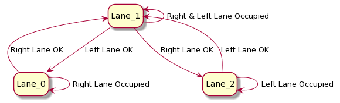

# CarND-Path-Planning-Project
Self-Driving Car Engineer Nanodegree Program
   


## Goals
In this project the goal is to safely navigate around a virtual highway with other traffic that is driving +-10 MPH of the 50 MPH speed limit. The car's localization and sensor fusion data are provied, there is also a sparse map list of waypoints around the highway. The car should try to go as close as possible to the 50 MPH speed limit, which means passing slower traffic when possible, note that other cars will try to change lanes too. The car should avoid hitting other cars at all cost as well as driving inside of the marked road lanes at all times, unless going from one lane to another. The car should be able to make one complete loop around the 6946m highway. Since the car is trying to go 50 MPH, it should take a little over 5 minutes to complete 1 loop. Also the car should not experience total acceleration over 10 m/s^2 and jerk that is greater than 10 m/s^3.

## Resources
### Simulator.
You can download the Term3 Simulator which contains the Path Planning Project from the [releases tab (https://github.com/udacity/self-driving-car-sim/releases/tag/T3_v1.2).  

To run the simulator on Mac/Linux, first make the binary file executable with the following command:
```shell
sudo chmod u+x {simulator_file_name}
```
### The map of the highway is in data/highway_map.txt
Each waypoint in the list contains  [x,y,s,dx,dy] values. x and y are the waypoint's map coordinate position, the s value is the distance along the road to get to that waypoint in meters, the dx and dy values define the unit normal vector pointing outward of the highway loop.

The highway's waypoints loop around so the frenet s value, distance along the road, goes from 0 to 6945.554.

## Basic Build Instructions

1. Clone this repo.
2. Make a build directory: `mkdir build && cd build`
3. Compile: `cmake .. && make`
4. Run it: `./path_planning`.

### Dependencies

* cmake >= 3.5
  * All OSes: [click here for installation instructions](https://cmake.org/install/)
* make >= 4.1
  * Linux: make is installed by default on most Linux distros
  * Mac: [install Xcode command line tools to get make](https://developer.apple.com/xcode/features/)
  * Windows: [Click here for installation instructions](http://gnuwin32.sourceforge.net/packages/make.htm)
* gcc/g++ >= 5.4
  * Linux: gcc / g++ is installed by default on most Linux distros
  * Mac: same deal as make - [install Xcode command line tools]((https://developer.apple.com/xcode/features/)
  * Windows: recommend using [MinGW](http://www.mingw.org/)
* [uWebSockets](https://github.com/uWebSockets/uWebSockets)
  * Run either `install-mac.sh` or `install-ubuntu.sh`.
  * If you install from source, checkout to commit `e94b6e1`, i.e.
    ```
    git clone https://github.com/uWebSockets/uWebSockets 
    cd uWebSockets
    git checkout e94b6e1
    ```


Here is the data provided from the Simulator to the C++ Program

#### Main car's localization Data (No Noise)

["x"] The car's x position in map coordinates

["y"] The car's y position in map coordinates

["s"] The car's s position in frenet coordinates

["d"] The car's d position in frenet coordinates

["yaw"] The car's yaw angle in the map

["speed"] The car's speed in MPH

#### Previous path data given to the Planner

//Note: Return the previous list but with processed points removed, can be a nice tool to show how far along
the path has processed since last time. 

["previous_path_x"] The previous list of x points previously given to the simulator

["previous_path_y"] The previous list of y points previously given to the simulator

#### Previous path's end s and d values 

["end_path_s"] The previous list's last point's frenet s value

["end_path_d"] The previous list's last point's frenet d value

#### Sensor Fusion Data, a list of all other car's attributes on the same side of the road. (No Noise)

["sensor_fusion"] A 2d vector of cars and then that car's [car's unique ID, car's x position in map coordinates, car's y position in map coordinates, car's x velocity in m/s, car's y velocity in m/s, car's s position in frenet coordinates, car's d position in frenet coordinates. 
## Path Planning
Some of my work in this project will be introduced in here. 

### Behavior Planning
The vehicle behavior(stop, change lane etc) should adapted accoring the different situation. In this project, the changing lane behavior is one important function. In ther situation where the front vehicle is too slow, the vehicle should condiser of changing lane, one brief state machine is shown as following:


This state machine is implement use the following code (Line 194-223):

```C++
            switch (lane)
            {
            case 0:
              if(right_clear && (right_lane_speed > current_lane_speed))
                lane = 1;
              break;
            case 1:
              if(right_clear && left_clear)
              {
                if(right_lane_speed > left_lane_speed)
                  lane = 2;
                else if(left_lane_speed >= right_lane_speed)
                  lane = 0;
              }
              else if(right_clear && (!left_clear))
              {
                lane = 2;
              }
              else if((!right_clear) && left_clear)
              {
                lane = 0;
              }
              break;
            case 2:
              if(left_clear && (left_lane_speed >= current_lane_speed))
                lane = 1;
              break;
            default:
              break;
            }
```

Before the running of state machine, the left and right lane is checked if they are clear for changing lane.
```C++
          for(int i=0; i<sensor_fusion.size(); i++)
          {
            //car is in my lane
            float d = sensor_fusion[i][6];
            double vx = sensor_fusion[i][3];
            double vy = sensor_fusion[i][4];
            double check_speed = sqrt(vx*vx + vy*vy);
            double check_car_s = sensor_fusion[i][5];

            check_car_s += ((double)prev_size*0.02*check_speed);//if using previous points can project s value out
            if(d<(2+4*lane+2) && d>(2+4*lane-2))
            {
              //check s values greater than mine and s gap
              if((check_car_s > car_s) && ((check_car_s - car_s)<30))
              {
                too_close = true;
                current_lane_speed = check_speed;
              }
            }

            double front_safe_dis = 20;
            double behind_safe_dis = 10;
            //check left lane
            if(d <(2+4*(lane-1)+2) && d>(2+4*(lane-1)-2))
            {
              
              //if check_car in behind but too close, left lane not clear
              if((check_car_s < car_s) && ((car_s - check_car_s)<behind_safe_dis))
              {
                left_clear = false;
              }
              //if check_car in front but too close, left lane not clear 
              else if((check_car_s > car_s) && ((check_car_s - car_s)<front_safe_dis))
              {
                left_clear = false;
              }
              else if((check_car_s < car_s) && ((check_speed - ref_vel)>10))
              {
                left_clear = false;
              }

              if(check_car_s > car_s)
                left_lane_speed = check_speed;
            }

            //check right lane
            if(d <(2+4*(lane+1)+2) && d>(2+4*(lane+1)-2))
            {
              //if check_car in behind but too close, right lane not clear
              if((check_car_s < car_s) && ((car_s - check_car_s)<behind_safe_dis))
              {
                right_clear = false;
              }
              //if check_car in front but too close, right lane not clear 
              else if((check_car_s > car_s) && ((check_car_s - car_s)<front_safe_dis))
              {
                right_clear = false;
              }
              else if((check_car_s < car_s) && ((check_speed - ref_vel)>10))
              {
                right_clear = false;
              }

              if(check_car_s > car_s)
                right_lane_speed = check_speed;
            }
            
          }
```
Beside of changing lane, acceleration and deacceleration are also important behavior. According the video of Project Q&A, those two behavior can be implemented as following:
```C++
          if(too_close)
          {
            ref_vel -=0.224;
              .....
          }
          else if(ref_vel < 49.5)
          {
            ref_vel += 0.224;
              .....
          }
```
### Trajectory Generation
The trajectory generation is implemented according the video of Project Q&A where the spline libary is used.

In order to generate trajectory, some waypoints should be chose. Considering of tracking reference state, the staring point could be where the car is or at the previous paths and point according the previous path size:
```C++
          //if previous size is almost empty, use the car as starting reference
          if(prev_size < 2)
          {
            // use two points that make the path tangent to the car 
            double prev_car_x = car_x - cos(car_yaw);
            double prev_car_y = car_y - sin(car_yaw);

            ptsx.push_back(prev_car_x);
            ptsx.push_back(car_x);

            ptsy.push_back(prev_car_y);
            ptsy.push_back(car_y);  
          }
          // use the previous path's end point as starting reference
          else
          {
            // redefine reference state as previous path end point
            ref_x = previous_path_x[prev_size - 1];
            ref_y = previous_path_y[prev_size - 1];

            double ref_x_prev = previous_path_x[prev_size - 2];
            double ref_y_prev = previous_path_y[prev_size - 2];
            ref_yaw = atan2(ref_y - ref_y_prev, ref_x - ref_x_prev);

            //Ust two points that make the path tangent to the previous path's end point
            ptsx.push_back(ref_x_prev);
            ptsx.push_back(ref_x);

            ptsy.push_back(ref_y_prev);
            ptsy.push_back(ref_y); 
          }
```

where the ```ptsx``` and ```ptsy``` is two vector of waypoints:
```C++
          vector<double> ptsx;
          vector<double> ptsy;
```
The ```prev_size``` is previous path size:
```C++
    int prev_size = previous_path_x.size(); 
```
Then three waypoints are calculated in the lane distance of 30, 60 and 90 meters:
```C++
 //In Frenet add evenly 30m spaced points ahead of the starting reference
          vector<double> next_wp0 = getXY(car_s + 30, (2 + 4*lane), map_waypoints_s, map_waypoints_x, map_waypoints_y);
          vector<double> next_wp1 = getXY(car_s + 60, (2 + 4*lane), map_waypoints_s, map_waypoints_x, map_waypoints_y);
          vector<double> next_wp2 = getXY(car_s + 90, (2 + 4*lane), map_waypoints_s, map_waypoints_x, map_waypoints_y);

          ptsx.push_back(next_wp0[0]);
          ptsx.push_back(next_wp1[0]);
          ptsx.push_back(next_wp2[0]);

          ptsy.push_back(next_wp0[1]);
          ptsy.push_back(next_wp1[1]);
          ptsy.push_back(next_wp2[1]);
```
After all waypoints are chosen, one spline is created for interpolation:
```C++
          // create a spline
          tk::spline s;

          // set (x, y) points to the spline
          s.set_points(ptsx, ptsy);
```
For the new trajectory, we can start from points in the previous path without processed for reducing the calculation:
```C++
          for(int i=0; i<previous_path_x.size(); i++)
          {
            next_x_vals.push_back(previous_path_x[i]);
            next_y_vals.push_back(previous_path_y[i]);
          }
```

Then the remainder points can be generated as follwing:
```C++
//Fill up the rest of our path planner after filling it with previous points, here we will always output 50 points 
          int num_points = 50;

          for( int i = 1; i <= num_points - prev_size; i++ ) 
          {
              
            double N = target_dist/(0.02*ref_vel/2.24);
            double x_point = x_add_on + target_x/N;
            double y_point = s(x_point);
            
            x_add_on = x_point;
            
            double x_ref = x_point;
            double y_ref = y_point;
            //Rotate back to normal after rotating it earlier
            x_point = x_ref*cos(ref_yaw) - y_ref*sin(ref_yaw);
            y_point = x_ref*sin(ref_yaw) + y_ref*cos(ref_yaw);
            
            x_point += ref_x;
            y_point += ref_y;
            
            next_x_vals.push_back(x_point);
            next_y_vals.push_back(y_point);
          }
```
In here, we keep the trajectory points in 50.

## Details

1. The car uses a perfect controller and will visit every (x,y) point it recieves in the list every .02 seconds. The units for the (x,y) points are in meters and the spacing of the points determines the speed of the car. The vector going from a point to the next point in the list dictates the angle of the car. Acceleration both in the tangential and normal directions is measured along with the jerk, the rate of change of total Acceleration. The (x,y) point paths that the planner recieves should not have a total acceleration that goes over 10 m/s^2, also the jerk should not go over 50 m/s^3. (NOTE: As this is BETA, these requirements might change. Also currently jerk is over a .02 second interval, it would probably be better to average total acceleration over 1 second and measure jerk from that.

2. There will be some latency between the simulator running and the path planner returning a path, with optimized code usually its not very long maybe just 1-3 time steps. During this delay the simulator will continue using points that it was last given, because of this its a good idea to store the last points you have used so you can have a smooth transition. previous_path_x, and previous_path_y can be helpful for this transition since they show the last points given to the simulator controller with the processed points already removed. You would either return a path that extends this previous path or make sure to create a new path that has a smooth transition with this last path.
